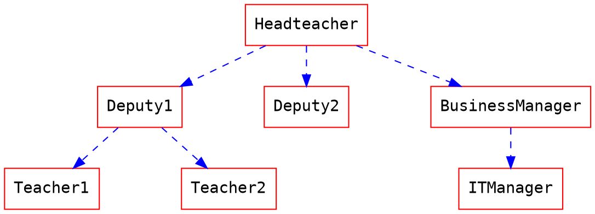
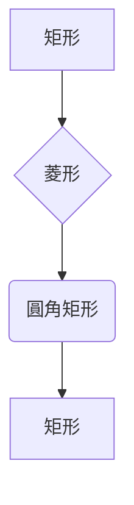
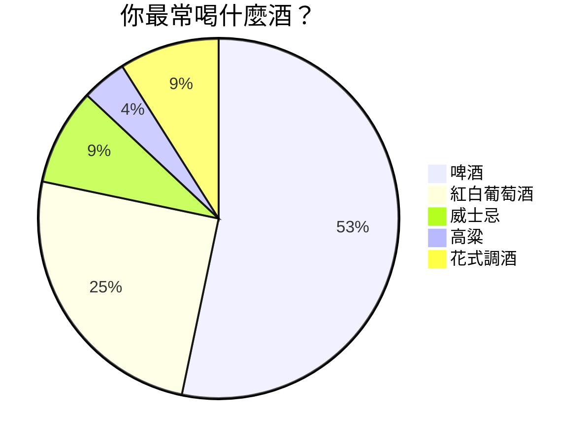
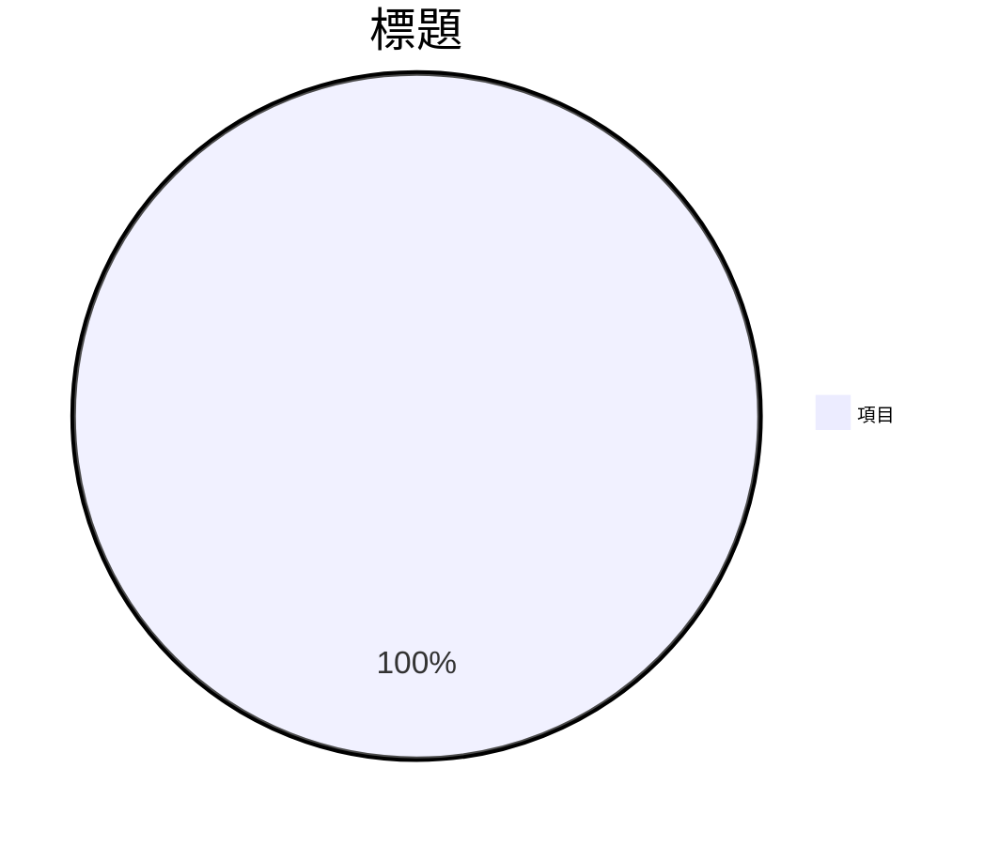
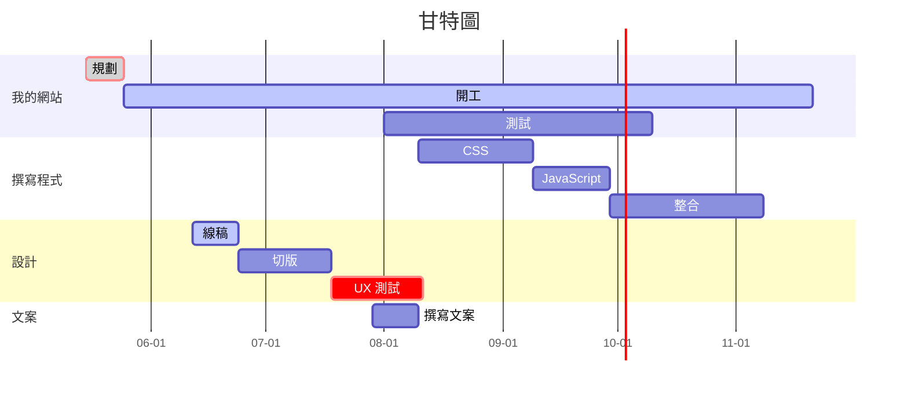

# HackMD 完整語法指南

###### tags: `HackMD` `Markdown` `語法指南`

[TOC]

---

## 1. YAML Metadata（前言區）

在筆記最上方使用 YAML 格式設定筆記屬性：

```yaml
---
title: 筆記標題
description: 筆記描述
image: https://example.com/image.png
tags: 功能, 教學
robots: noindex, nofollow
lang: zh-tw
dir: ltr
breaks: true
GA: UA-XXXXXXXX-X
disqus: disqus_id
slideOptions:
  transition: slide
  theme: solarized
---
```

| 欄位 | 說明 |
| --- | --- |
| `title` | 筆記標題 |
| `description` | 筆記描述（連結預覽用） |
| `image` | 預設圖片（連結預覽用） |
| `tags` | 筆記標籤 |
| `robots` | 搜尋引擎機器人 meta |
| `lang` | 瀏覽器顯示語言 |
| `dir` | 文字方向（`ltr` / `rtl`） |
| `breaks` | 是否啟用換行 |
| `GA` | Google Analytics 追蹤碼 |
| `disqus` | Disqus 留言區 ID |
| `slideOptions` | 簡報模式選項 |

---

## 2. 標題

### `#` 語法

```markdown
# h1 標題
## h2 標題
### h3 標題
#### h4 標題
##### h5 標題
###### h6 標題
```

### 替代語法

```markdown
一級標題
===

二級標題
---
```

`===` 等同 `# 標題`，`---` 等同 `## 標題`。

---

## 3. 標籤

```markdown
###### tags: `功能` `酷` `更新`
```

---

## 4. 目錄

```markdown
[TOC]
```

自動產生目錄，支援到第三層標題。

---

## 5. 文字格式

### 粗體

```markdown
**粗體文字**
__粗體文字__
```

### 斜體

```markdown
*斜體文字*
_斜體文字_
```

### 刪除線

```markdown
~~刪除線文字~~
```

### 底線

```markdown
++底線文字++
```

### 螢光標記

```markdown
==標記文字==
```

### 上標

```markdown
19^th^
```

### 下標

```markdown
H~2~O
```

### 旁註標記（Ruby Annotation）

```markdown
{旁註標記|注音或拼音}
```

小字會顯示在主文字上方，常用於 CJK 注音標記。

---

## 6. 文字顏色

### 方法一：`<font>` 標籤

```html
<font color="#f00">紅色文字</font>
<font color="#1936C9">藍色文字</font>
<font color="#F7A004">橘色文字</font>
```

色碼支援三位（`#f00`）或六位（`#FF0000`）十六進位格式。

### 方法二：CSS class

```html
<style>
.blue { color: blue; }
.orange { color: orange; }
</style>

<span class="blue">藍色文字</span>
<span class="orange">橘色文字</span>
```

適合重複使用相同顏色時。

---

## 7. Emoji

### 代碼輸入

輸入 `:` 觸發自動搜尋：

```markdown
:smiley:
:point_right:
:bouquet:
:bell:
:tada:
:fire:
:mega:
:zap:
```

### 直接貼上

可從任何地方複製 emoji 直接貼入筆記。

> Emoji 搜尋工具：https://hackmdio.github.io/emoji-datasource-finder/

---

## 8. 引用區塊

### 基本引用

```markdown
> 這是引用區塊
>> 巢狀引用
>>> 更深層的巢狀引用
```

### 帶署名的引用

```markdown
> 這是我的留言
> [name=使用者名稱] [time=Sun, Jun 28, 2015 9:59 PM] [color=#907bf7]
```

| 標記 | 說明 |
| --- | --- |
| `[name=名稱]` | 署名 |
| `[time=時間]` | 時間戳記 |
| `[color=色碼]` | 引用區塊顏色 |

---

## 9. 清單

### 無序清單

```markdown
- 項目一
- 項目二
  - 子項目（縮排兩個空白）
    - 更深子項目
```

標記符號可用 `-`、`+` 或 `*`，不同符號會強制建立新的清單。

### 有序清單

```markdown
1. 第一項
2. 第二項
3. 第三項
```

也可以全部用 `1.`，會自動編號：

```markdown
1. foo
1. bar
1. baz
```

可從任意數字開始：

```markdown
57. foo
1. bar
```

### 待辦清單（Checkbox）

```markdown
- [ ] 未完成
- [x] 已完成
  - [ ] 巢狀未完成
  - [x] 巢狀已完成
```

---

## 10. 連結

### 基本連結

```markdown
[連結文字](https://hackmd.io)
```

### 帶標題的連結

```markdown
[連結文字](https://hackmd.io "滑鼠懸停顯示的標題")
```

### 自動連結

```markdown
https://hackmd.io
```

直接貼上網址會自動轉為可點擊連結。

### 參照式連結

```markdown
[連結標籤]: https://hackmd.io "HackMD"

點擊 [連結標籤] 前往。
```

---

## 11. 圖片

### 基本圖片

```markdown

```

### 帶標題的圖片

```markdown

```

### 參照式圖片

```markdown
![替代文字][img-id]

[img-id]: https://example.com/image.png "圖片標題"
```

### 調整圖片大小

**百分比縮放：**（`=` 前須有空格）

```markdown

```

**固定像素寬度：**

```markdown

```

**固定寬高：**

```markdown

```

### 圖片對齊（HTML）

**置中：**

```html
<div style="text-align: center;">
  
</div>
```

**靠右：**

```html
<div style="text-align: right;">
  
</div>
```

### 支援格式

`png`、`jpg`、`gif`、`bmp`、`tif`

---

## 12. 表格

### 基本表格

```markdown
| 欄位一 | 欄位二 | 欄位三 |
| ------ | ------ | ------ |
| 資料   | 資料   | 資料   |
| 資料   | 資料   | 資料   |
```

### 對齊方式

```markdown
| 靠左對齊 | 置中對齊 | 靠右對齊 |
|:-------- |:--------:| --------:|
| 左       | 中       | 右       |
```

| 語法 | 對齊 |
| --- | --- |
| `:------` | 靠左 |
| `:------:` | 置中 |
| `------:` | 靠右 |

### 表格快捷鍵

| 快捷鍵 | 功能 |
| --- | --- |
| <kbd>Shift</kbd>+<kbd>Ctrl</kbd>+<kbd>Left</kbd> | 靠左對齊 |
| <kbd>Shift</kbd>+<kbd>Ctrl</kbd>+<kbd>Right</kbd> | 靠右對齊 |
| <kbd>Shift</kbd>+<kbd>Ctrl</kbd>+<kbd>Up</kbd> | 置中對齊 |
| <kbd>Shift</kbd>+<kbd>Ctrl</kbd>+<kbd>Down</kbd> | 取消對齊 |

> 從 Excel 複製表格時，開啟「Smart Paste」功能即可自動轉換為 Markdown 表格。

---

## 13. 程式碼

### 行內程式碼

```markdown
行內 `console.log()` 程式碼
```

### 縮排程式碼區塊

    // 四個空格縮排
    line 1 of code
    line 2 of code

### 程式碼區塊（無高亮）

````markdown
```
function hello() {
  return "world";
}
```
````

### 指定語言（語法高亮）

````markdown
```javascript
var foo = function (bar) {
  return bar++;
};
```
````

### 顯示行號

語言名稱後加 `=`：

````markdown
```javascript=
var s = "JavaScript syntax highlighting";
alert(s);
```
````

### 指定起始行號

````markdown
```javascript=101
var s = "從第 101 行開始";
alert(s);
```
````

### 延續上一個區塊的行號

````markdown
```javascript=+
var s = "延續前一個區塊的行號";
alert(s);
```
````

### 自動換行

以 `!` 作為語言標識：

````markdown
```!
這是一段很長很長的文字，會自動換行而不會超出程式碼區塊的範圍。
```
````

---

## 14. 分隔線

三種寫法，效果相同：

```markdown
---
***
___
```

---

## 15. 註腳

### 基本註腳

```markdown
這裡有一個註腳[^1]。

[^1]: 這是註腳內容。
```

### 具名標籤註腳

```markdown
研究主題是圖書館裡哪種書最常被偷[^Schwitzgebel]。

[^Schwitzgebel]: Schwitzgebel 2009; Schwitzgebel and Rust 2014.
```

### 多段落註腳

```markdown
[^long]: 第一段落內容。

    第二段落須縮排四個空白。
```

### 行內註腳

```markdown
行內註腳^[直接在此寫註腳內容]
```

> **注意：** 註腳標籤不能包含空白，建議使用 `-`、`_` 或 CamelCase。自動依出現順序編號。

---

## 16. 定義清單

### 寬鬆格式

```markdown
名詞 1

:   定義 1

名詞 2

:   定義 2a

    定義 2 的第二段落
```

### 緊湊格式

```markdown
名詞 1
  ~ 定義 1

名詞 2
  ~ 定義 2a
  ~ 定義 2b
```

---

## 17. 縮寫

```markdown
這是 HTML 的範例。

*[HTML]: Hyper Text Markup Language
```

定義後，文中獨立出現的 `HTML` 會自動加上懸停提示。不影響嵌在其他文字中的情況（如 `xxxHTMLyyy`）。

---

## 18. 印刷字元自動轉換

```markdown
(c) (C)       → ©
(r) (R)       → ®
(tm) (TM)     → ™
(p) (P)       → §
+-            → ±
測試...       → 測試…（省略號）
--            → —（破折號）
"雙引號"      → 「智慧雙引號」
'單引號'      → 「智慧單引號」
```

---

## 19. 色塊強調（Admonition）

### 四種色塊

```markdown
:::success
成功 — 綠色色塊 :tada:
:::

:::info
資訊 — 藍色色塊 :mega:
:::

:::warning
警告 — 黃色色塊 :zap:
:::

:::danger
危險 — 紅色色塊 :fire:
:::
```

### 巢狀色塊

外層用四個冒號 `::::`，內層用三個 `:::`：

```markdown
::::info
外層藍色色塊
:::danger
內層紅色色塊
:::
外層繼續
::::
```

---

## 20. GitHub Alert 警示區塊

```markdown
> [!NOTE]備註
> 備註內容

> [!TIP]小提醒
> 提示內容

> [!IMPORTANT]重要
> 重要資訊

> [!WARNING]注意
> 警告內容

> [!CAUTION]危險
> 危險提醒
```

`[!TYPE]` 後可直接加上自訂標題文字。

---

## 21. 收合區塊（Spoiler）

### 預設標題

```markdown
:::spoiler
收合的內容，預設標題為「詳細資料」
:::
```

### 自訂標題

```markdown
:::spoiler 點擊展開
隱藏的內容
:::
```

### 預設展開

```markdown
:::spoiler {state="open"} 預設展開的標題
一開始就顯示的內容
:::
```

---

## 22. 嵌入外部內容

### YouTube

```markdown

```

影片 ID 取自 URL 中 `v=` 後的字串。

### Vimeo

```markdown

```

### GitHub Gist

```markdown

```

### SlideShare

```markdown

```

### Speakerdeck

```markdown

```

### PDF（須使用 https）

```markdown

```

### Figma

```markdown

```

### iframe

```html
<iframe width="100%" height="500" src="https://hackmd.io/features" frameborder="0"></iframe>
```

> 在編輯器中輸入 `{}` 可觸發嵌入自動完成。

---

## 23. 嵌入 HackMD 筆記

### 以筆記 ID 嵌入

```markdown

```

### 以使用者路徑嵌入

```markdown

```

### 嵌入主題樣式

```markdown




```

利用 `<style>` 標籤定義 CSS，搭配嵌入功能可為筆記套用自訂主題。

---

## 24. 數學式（MathJax / LaTeX）

### 行內數學式

```markdown
滿足 $\Gamma(n) = (n-1)!\quad\forall n\in\mathbb N$ 的 Gamma 函數
```

`$` 前後不能有空格。

### 區塊數學式

```markdown
$$
x = {-b \pm \sqrt{b^2-4ac} \over 2a}
$$
```

```markdown
$$
\Gamma(z) = \int_0^\infty t^{z-1}e^{-t}dt\,.
$$
```

---

## 25. UML 時序圖（Sequence Diagram）

````markdown
```sequence
艾莉絲->包柏: 哈摟，你好嗎？
Note right of 包柏: 包柏思考中
包柏-->艾莉絲: 我很好，謝謝！
Note left of 艾莉絲: 艾莉絲回應
艾莉絲->包柏: 最近過得怎樣？
```
````

| 語法 | 說明 |
| --- | --- |
| `->` | 實線箭頭（同步訊息） |
| `-->` | 虛線箭頭（回應/非同步） |
| `Note right of 名稱:` | 右側備註 |
| `Note left of 名稱:` | 左側備註 |

---

## 26. 流程圖（flow.js）

````markdown
```flow
st=>start: 開始
e=>end: 結束
op=>operation: 我的操作
op2=>operation: 啦啦啦
cond=>condition: 是或否？

st->op->op2->cond
cond(yes)->e
cond(no)->op2
```
````

**節點定義：** `id=>type: 標籤文字`

| 節點類型 | 說明 |
| --- | --- |
| `start` | 開始 |
| `end` | 結束 |
| `operation` | 操作 |
| `condition` | 條件判斷 |

**連接：** `->` 串連節點，條件用 `(yes)` / `(no)` 分支。

---

## 27. Graphviz

````markdown

````

| 語法 | 說明 |
| --- | --- |
| `digraph name {}` | 有向圖 |
| `node [屬性]` | 全域節點樣式 |
| `edge [屬性]` | 全域邊線樣式 |
| `A->{B C}` | 一對多連接 |
| `{rank=same; A B}` | 強制同一層級 |

---

## 28. Mermaid 圖表

### 流程圖

````markdown

````

**方向：**

| 值 | 說明 |
| --- | --- |
| `TD` / `TB` | 由上到下 |
| `LR` | 由左到右 |

**節點形狀：**

| 語法 | 形狀 |
| --- | --- |
| `A[文字]` | 矩形 |
| `B{文字}` | 菱形（判斷） |
| `C(文字)` | 圓角矩形 |

**箭頭：** `-->` 標準箭頭，`--->` 加長箭頭。

### 圓餅圖

````markdown

````

**自訂圖例文字大小：**

````markdown

````

### 甘特圖

````markdown

````

**任務語法：**

```
顯示名稱 : [crit], [active|done], 任務ID, [日期|after 其他任務ID], 持續時間
```

| 關鍵字 | 說明 |
| --- | --- |
| `crit` | 關鍵任務（紅色標示） |
| `done` | 已完成（灰色） |
| `active` | 進行中（高亮） |
| `after taskId` | 在某任務後開始 |
| `10d` | 持續天數 |

**其他設定：**

| 語法 | 說明 |
| --- | --- |
| `dateFormat MM-DD` | 輸入日期格式 |
| `axisFormat %m-%d` | 軸線顯示格式 |
| `section 名稱` | 區塊分組 |
| `%%` | 註解 |

---

## 29. Markmap 心智圖

````markdown
```markmap
# 主題
## 分支一
- 葉節點 A
- 葉節點 B
## 分支二
- [連結](https://example.com)
- **粗體** 和 *斜體*
## 分支三
- `行內程式碼`
```
````

標題層級（`#`、`##`）定義樹狀結構，清單項目（`-`）為葉節點。支援行內格式與連結。

---

## 30. Vega-Lite 圖表

````markdown
```vega
{
  "$schema": "https://vega.github.io/schema/vega-lite/v4.json",
  "data": {"url": "https://vega.github.io/editor/data/barley.json"},
  "mark": "bar",
  "encoding": {
    "x": {"aggregate": "sum", "field": "yield", "type": "quantitative"},
    "y": {"field": "variety", "type": "nominal"},
    "color": {"field": "site", "type": "nominal"}
  }
}
```
````

使用 Vega-Lite JSON 規範繪製資料視覺化圖表。

---

## 31. ABC 樂譜

````markdown
```abc
X:1
T:Speed the Plough
M:4/4
C:Trad.
K:G
|:GABc dedB|dedB dedB|c2ec B2dB|c2A2 A2BA|
GABc dedB|dedB dedB|c2ec B2dB|A2F2 G4:|
|:g2gf gdBd|g2f2 e2d2|c2ec B2dB|c2A2 A2df|
g2gf g2Bd|g2f2 e2d2|c2ec B2dB|A2F2 G4:|
```
````

**標頭欄位：**

| 欄位 | 說明 | 範例 |
| --- | --- | --- |
| `X:` | 參考編號 | `X:1` |
| `T:` | 曲名 | `T:Speed the Plough` |
| `M:` | 拍號 | `M:4/4` |
| `C:` | 作曲者 | `C:Trad.` |
| `L:` | 預設音符長度 | `L:1/8` |
| `K:` | 調號 | `K:G` 或 `K:Cmaj` |
| `R:` | 曲風/地區 | `R:Chinese Taipei` |
| `Q:` | 速度 | `Q:1/4=120` |

**音符語法：**

| 記號 | 說明 |
| --- | --- |
| `C D E F G A B` | 低八度音符 |
| `c d e f g a b` | 高八度音符 |
| `E2` | 二倍長度 |
| `D4` | 四倍長度 |
| `C>E` | 附點節奏（C 附點、E 縮短） |
| `z` | 休止符 |
| `z2` | 二倍長度休止符 |
| `\|` | 小節線 |
| `\|:` | 反覆開始 |
| `:\|` | 反覆結束 |
| `\|\]` | 終止雙小節線 |
| `$` | 換行/換行標記 |

相鄰音符無空格會被連結為一組（如 `AGFE` = 四個八分音符連結）。

---

## 32. 書本模式

將筆記組織成書本形式，以無序清單加連結作為目錄：

```markdown
書本標題
===

章節一
---

- [第一篇](/s/note-id-1)
- [第二篇](/s/note-id-2)

章節二
---

- [第三篇](/s/note-id-3)
- [外部連結](https://example.com) [target=_blank]
```

| 語法 | 說明 |
| --- | --- |
| `===` | 書本標題（H1） |
| `---` | 章節標題（H2） |
| `- [文字](連結)` | 目錄項目（必須是無序清單） |
| `[target=_blank]` | 在新分頁開啟連結 |

---

## 33. 簡報模式

### 水平分頁（主要章節）

用 `---` 分隔（前後須空行）：

```markdown
# 第一張投影片

---

# 第二張投影片

---

# 第三張投影片
```

### 垂直子頁（章節內子頁）

用 `----`（四個連字號）分隔：

```markdown
# 章節 1

---

# 章節 2

----

## 章節 2.1

----

## 章節 2.2

---

# 章節 3
```

`---` 水平切換章節，`----` 垂直切換子頁，形成二維網格。

### 單頁屬性

```html
<!-- .slide: data-background="https://example.com/bg.jpg" -->
```

置於分頁符號後方，設定單張投影片的屬性（如背景圖）。

### 簡報選項（YAML）

```yaml
slideOptions:
  theme: solarized
  transition: slide
  spotlight:
    enabled: true
  allottedMinutes: 5
```

**可用主題：** `black`, `white`, `league`, `beige`, `sky`, `night`, `serif`, `simple`, `solarized`

**換頁動畫：** `none`, `fade`, `slide`, `convex`, `concave`, `zoom`

### 完整 YAML 選項參考

```yaml
controls: true            # 右下角控制按鈕
progress: true            # 進度條
slideNumber: false        # 頁碼
history: false            # 推入瀏覽器歷史
keyboard: true            # 鍵盤快捷鍵
overview: true            # 投影片總覽
center: true              # 垂直置中
touch: true               # 觸控導覽
loop: false               # 循環播放
rtl: false                # 右到左方向
shuffle: false            # 隨機順序
fragments: true           # 片段動畫
embedded: false           # 嵌入模式
help: true                # 說明疊加層
showNotes: false          # 顯示講者備註
autoPlayMedia: null       # 自動播放媒體
autoSlide: 0              # 自動換頁（毫秒，0=關閉）
autoSlideStoppable: true  # 使用者可停止自動換頁
mouseWheel: false         # 滑鼠滾輪導覽
hideAddressBar: true      # 隱藏手機網址列
previewLinks: false       # iframe 預覽連結
transition: 'slide'       # 換頁動畫
transitionSpeed: 'default'  # default/fast/slow
backgroundTransition: 'fade' # 背景換頁動畫
viewDistance: 3           # 可見距離（頁數）
parallaxBackgroundImage: ''  # 視差背景圖
parallaxBackgroundSize: ''   # 視差背景大小
display: 'block'          # 顯示模式
```

### 簡報快捷鍵

| 按鍵 | 功能 |
| --- | --- |
| <kbd>Esc</kbd> | 投影片總覽 |
| <kbd>Enter</kbd> | 進入選取的投影片 |
| <kbd>s</kbd> | 講者備註視窗 |
| 方向鍵 | 導覽投影片 |

---

## 34. 不換行空白與 HTML 元素

### 不換行空白

```html
&nbsp;
```

### 鍵盤按鍵樣式

```html
<kbd>Ctrl</kbd>+<kbd>C</kbd>
```

### Font Awesome 圖示

```html
<i class="fa fa-file-text"></i>
<i class="fa fa-camera"></i>
<i class="fa fa-github"></i>
<i class="fa fa-pencil fa-fw"></i>
```

---

## 35. 支援的圖表語言總覽

| 語言標記 | 圖表類型 |
| --- | --- |
| `$...$` | 行內數學式（MathJax） |
| `$$...$$` | 區塊數學式（MathJax） |
| ` ```sequence ` | UML 時序圖 |
| ` ```flow ` | 流程圖（flow.js） |
| ` ```graphviz ` | Graphviz 有向圖 |
| ` ```mermaid ` + `graph` | Mermaid 流程圖 |
| ` ```mermaid ` + `pie` | Mermaid 圓餅圖 |
| ` ```mermaid ` + `gantt` | Mermaid 甘特圖 |
| ` ```markmap ` | 心智圖 |
| ` ```vega ` | Vega-Lite 資料視覺化 |
| ` ```abc ` | ABC 樂譜 |

---

## 36. HackMD 專屬語法速查表

| 語法 | 功能 |
| --- | --- |
| `` | 嵌入 HackMD 筆記 |
| `` | 嵌入 YouTube |
| `` | 嵌入 Vimeo |
| `` | 嵌入 Gist |
| `` | 嵌入 SlideShare |
| `` | 嵌入 Speakerdeck |
| `` | 嵌入 PDF |
| `` | 嵌入 Figma |
| `[TOC]` | 自動目錄 |
| `:::success/info/warning/danger` | 色塊強調 |
| `:::spoiler` | 收合區塊 |
| `> [!NOTE/TIP/IMPORTANT/WARNING/CAUTION]` | GitHub Alert |
| `[name=X] [time=X] [color=X]` | 引用署名 |
| `==文字==` | 螢光標記 |
| `++文字++` | 底線 |
| `^文字^` | 上標 |
| `~文字~` | 下標 |
| `{旁註\|標記}` | Ruby 旁註 |
| `^[行內註腳]` | 行內註腳 |
| `` | 圖片尺寸 |
| `` ```lang= `` | 程式碼行號 |
| `` ```lang=101 `` | 指定起始行號 |
| `` ```lang=+ `` | 延續行號 |
| `` ```! `` | 自動換行程式碼 |
| `---` / `----` | 簡報分頁 / 子頁 |
| `<!-- .slide: -->` | 簡報單頁屬性 |
