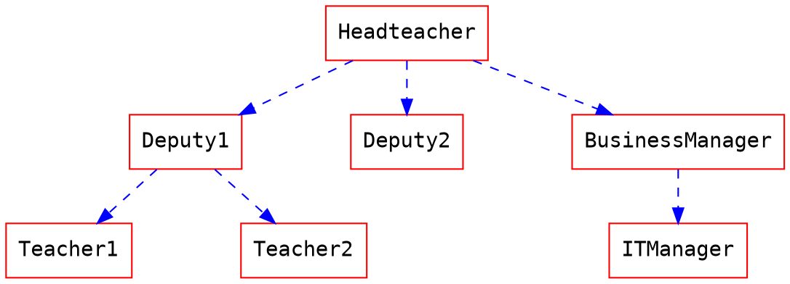
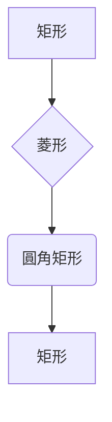
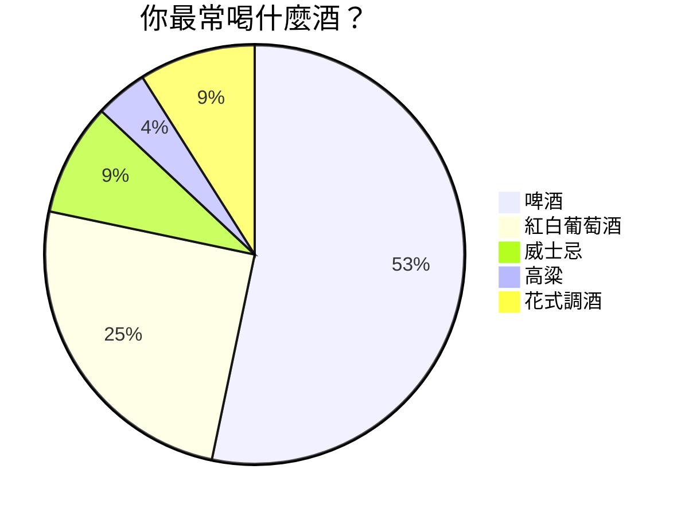
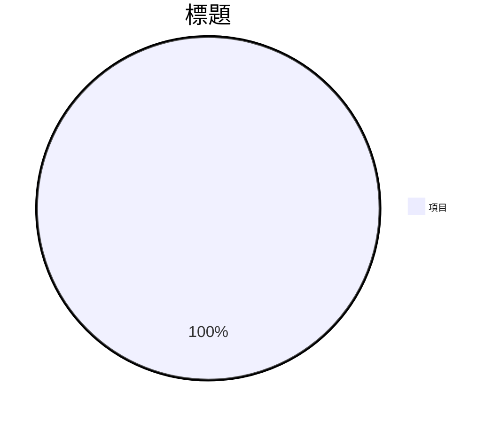
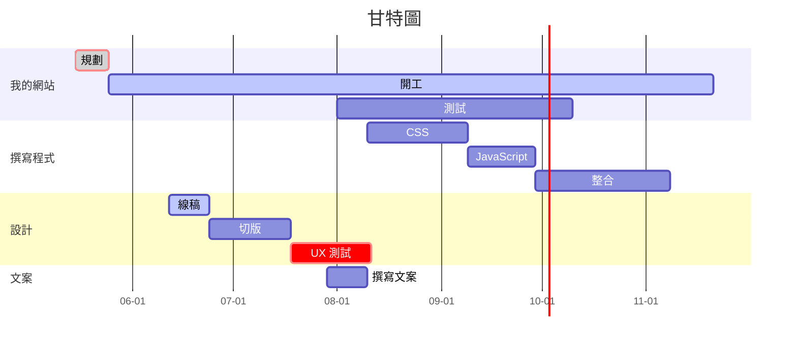

# HackMD 語法參考 — 進階（圖表／樂譜／書本／簡報）

> 本文件語法內容整理自 HackMD 官方功能介紹與教學筆記（https://hackmd.io/features-tw ），
> 僅作為語法參考重排，非官方文件。

## 目錄

- 25. UML 時序圖（Sequence Diagram）
- 26. 流程圖（flow.js）
- 27. Graphviz
- 28. Mermaid 圖表
- 29. Markmap 心智圖
- 30. Vega-Lite 圖表
- 31. ABC 樂譜
- 32. 書本模式
- 33. 簡報模式

（§1–24、§34–36 常用語法見 syntax-core.md）

---

## 25. UML 時序圖（Sequence Diagram）

````markdown
```sequence
艾莉絲->包柏: 哈摟，你好嗎？
Note right of 包柏: 包柏思考中
包柏-->艾莉絲: 我很好，謝謝！
Note left of 艾莉絲: 艾莉絲回應
艾莉絲->包柏: 最近過得怎樣？
```
````

| 語法 | 說明 |
| --- | --- |
| `->` | 實線箭頭（同步訊息） |
| `-->` | 虛線箭頭（回應/非同步） |
| `Note right of 名稱:` | 右側備註 |
| `Note left of 名稱:` | 左側備註 |

---

## 26. 流程圖（flow.js）

````markdown
```flow
st=>start: 開始
e=>end: 結束
op=>operation: 我的操作
op2=>operation: 啦啦啦
cond=>condition: 是或否？

st->op->op2->cond
cond(yes)->e
cond(no)->op2
```
````

**節點定義：** `id=>type: 標籤文字`

| 節點類型 | 說明 |
| --- | --- |
| `start` | 開始 |
| `end` | 結束 |
| `operation` | 操作 |
| `condition` | 條件判斷 |

**連接：** `->` 串連節點，條件用 `(yes)` / `(no)` 分支。

---

## 27. Graphviz

````markdown

````

| 語法 | 說明 |
| --- | --- |
| `digraph name {}` | 有向圖 |
| `node [屬性]` | 全域節點樣式 |
| `edge [屬性]` | 全域邊線樣式 |
| `A->{B C}` | 一對多連接 |
| `{rank=same; A B}` | 強制同一層級 |

---

## 28. Mermaid 圖表

### 流程圖

````markdown

````

**方向：**

| 值 | 說明 |
| --- | --- |
| `TD` / `TB` | 由上到下 |
| `LR` | 由左到右 |

**節點形狀：**

| 語法 | 形狀 |
| --- | --- |
| `A[文字]` | 矩形 |
| `B{文字}` | 菱形（判斷） |
| `C(文字)` | 圓角矩形 |

**箭頭：** `-->` 標準箭頭，`--->` 加長箭頭。

### 圓餅圖

````markdown

````

**自訂圖例文字大小：**

````markdown

````

### 甘特圖

````markdown

````

**任務語法：**

```
顯示名稱 : [crit], [active|done], 任務ID, [日期|after 其他任務ID], 持續時間
```

| 關鍵字 | 說明 |
| --- | --- |
| `crit` | 關鍵任務（紅色標示） |
| `done` | 已完成（灰色） |
| `active` | 進行中（高亮） |
| `after taskId` | 在某任務後開始 |
| `10d` | 持續天數 |

**其他設定：**

| 語法 | 說明 |
| --- | --- |
| `dateFormat MM-DD` | 輸入日期格式 |
| `axisFormat %m-%d` | 軸線顯示格式 |
| `section 名稱` | 區塊分組 |
| `%%` | 註解 |

---

## 29. Markmap 心智圖

````markdown
```markmap
# 主題
## 分支一
- 葉節點 A
- 葉節點 B
## 分支二
- [連結](https://example.com)
- **粗體** 和 *斜體*
## 分支三
- `行內程式碼`
```
````

標題層級（`#`、`##`）定義樹狀結構，清單項目（`-`）為葉節點。支援行內格式與連結。

---

## 30. Vega-Lite 圖表

````markdown
```vega
{
  "$schema": "https://vega.github.io/schema/vega-lite/v4.json",
  "data": {"url": "https://vega.github.io/editor/data/barley.json"},
  "mark": "bar",
  "encoding": {
    "x": {"aggregate": "sum", "field": "yield", "type": "quantitative"},
    "y": {"field": "variety", "type": "nominal"},
    "color": {"field": "site", "type": "nominal"}
  }
}
```
````

使用 Vega-Lite JSON 規範繪製資料視覺化圖表。

---

## 31. ABC 樂譜

````markdown
```abc
X:1
T:Speed the Plough
M:4/4
C:Trad.
K:G
|:GABc dedB|dedB dedB|c2ec B2dB|c2A2 A2BA|
GABc dedB|dedB dedB|c2ec B2dB|A2F2 G4:|
|:g2gf gdBd|g2f2 e2d2|c2ec B2dB|c2A2 A2df|
g2gf g2Bd|g2f2 e2d2|c2ec B2dB|A2F2 G4:|
```
````

**標頭欄位：**

| 欄位 | 說明 | 範例 |
| --- | --- | --- |
| `X:` | 參考編號 | `X:1` |
| `T:` | 曲名 | `T:Speed the Plough` |
| `M:` | 拍號 | `M:4/4` |
| `C:` | 作曲者 | `C:Trad.` |
| `L:` | 預設音符長度 | `L:1/8` |
| `K:` | 調號 | `K:G` 或 `K:Cmaj` |
| `R:` | 曲風/地區 | `R:Chinese Taipei` |
| `Q:` | 速度 | `Q:1/4=120` |

**音符語法：**

| 記號 | 說明 |
| --- | --- |
| `C D E F G A B` | 低八度音符 |
| `c d e f g a b` | 高八度音符 |
| `E2` | 二倍長度 |
| `D4` | 四倍長度 |
| `C>E` | 附點節奏（C 附點、E 縮短） |
| `z` | 休止符 |
| `z2` | 二倍長度休止符 |
| `\|` | 小節線 |
| `\|:` | 反覆開始 |
| `:\|` | 反覆結束 |
| `\|\]` | 終止雙小節線 |
| `$` | 換行/換行標記 |

相鄰音符無空格會被連結為一組（如 `AGFE` = 四個八分音符連結）。

---

## 32. 書本模式

將筆記組織成書本形式，以無序清單加連結作為目錄：

```markdown
書本標題
===

章節一
---

- [第一篇](/s/note-id-1)
- [第二篇](/s/note-id-2)

章節二
---

- [第三篇](/s/note-id-3)
- [外部連結](https://example.com) [target=_blank]
```

| 語法 | 說明 |
| --- | --- |
| `===` | 書本標題（H1） |
| `---` | 章節標題（H2） |
| `- [文字](連結)` | 目錄項目（必須是無序清單） |
| `[target=_blank]` | 在新分頁開啟連結 |

---

## 33. 簡報模式

### 水平分頁（主要章節）

用 `---` 分隔（前後須空行）：

```markdown
# 第一張投影片

---

# 第二張投影片

---

# 第三張投影片
```

### 垂直子頁（章節內子頁）

用 `----`（四個連字號）分隔：

```markdown
# 章節 1

---

# 章節 2

----

## 章節 2.1

----

## 章節 2.2

---

# 章節 3
```

`---` 水平切換章節，`----` 垂直切換子頁，形成二維網格。

### 單頁屬性

```html
<!-- .slide: data-background="https://example.com/bg.jpg" -->
```

置於分頁符號後方，設定單張投影片的屬性（如背景圖）。

### 簡報選項（YAML）

```yaml
slideOptions:
  theme: solarized
  transition: slide
  spotlight:
    enabled: true
  allottedMinutes: 5
```

**可用主題：** `black`, `white`, `league`, `beige`, `sky`, `night`, `serif`, `simple`, `solarized`

**換頁動畫：** `none`, `fade`, `slide`, `convex`, `concave`, `zoom`

### 完整 YAML 選項參考

```yaml
controls: true            # 右下角控制按鈕
progress: true            # 進度條
slideNumber: false        # 頁碼
history: false            # 推入瀏覽器歷史
keyboard: true            # 鍵盤快捷鍵
overview: true            # 投影片總覽
center: true              # 垂直置中
touch: true               # 觸控導覽
loop: false               # 循環播放
rtl: false                # 右到左方向
shuffle: false            # 隨機順序
fragments: true           # 片段動畫
embedded: false           # 嵌入模式
help: true                # 說明疊加層
showNotes: false          # 顯示講者備註
autoPlayMedia: null       # 自動播放媒體
autoSlide: 0              # 自動換頁（毫秒，0=關閉）
autoSlideStoppable: true  # 使用者可停止自動換頁
mouseWheel: false         # 滑鼠滾輪導覽
hideAddressBar: true      # 隱藏手機網址列
previewLinks: false       # iframe 預覽連結
transition: 'slide'       # 換頁動畫
transitionSpeed: 'default'  # default/fast/slow
backgroundTransition: 'fade' # 背景換頁動畫
viewDistance: 3           # 可見距離（頁數）
parallaxBackgroundImage: ''  # 視差背景圖
parallaxBackgroundSize: ''   # 視差背景大小
display: 'block'          # 顯示模式
```

### 簡報快捷鍵

| 按鍵 | 功能 |
| --- | --- |
| <kbd>Esc</kbd> | 投影片總覽 |
| <kbd>Enter</kbd> | 進入選取的投影片 |
| <kbd>s</kbd> | 講者備註視窗 |
| 方向鍵 | 導覽投影片 |

---
